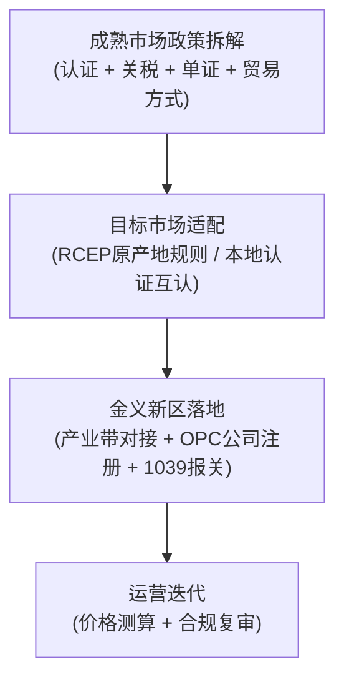

# aApp 演示实录（API 驱动 / remio 官方工具）
_生成时间 2026-08-21T08:38:53_

> 本实录通过 `remio --cn` CLI 直接调用 aApp 所用的同一组 syscall（rag / headless_fetch_content / run_prompt）重放，输出均为 remio 运行时真实返回，可作为演示证据。

## 1) /ask — 1039 市场采购免税（知识库 RAG + 引用）
_08:38:53_

你知识库中专门记录该主题的笔记是《1039 市场采购贸易方式》，但它的正文在检索结果中出现了大量字符损坏（中文显示为“？”），导致“如何免征增值税、如何简化申报”这两部分核心内容无法完整读取 [doc:1 sent:1]。

目前仍可辨认的信息如下：

- 笔记围绕 **1039 市场采购贸易方式** 展开，正文多次出现关键数字：**15**、**80%**，以及 **3–5 对 1** 的效率对比（单位均因缺字无法确认，推测涉及申报额度、适用比例和办理时长）[doc:1 sent:1][doc:1 sent:2]。
- 笔记包含适用条件、操作流程、注意事项等板块，注意事项中明确提到 **OPC** [doc:1 sent:2][doc:1 sent:3]。
- 关联笔记可作补充背景：
  - 《RCEP 与跨境关税优惠》提到 1039 可与 RCEP 原产地证（FORM R）结合，进一步叠加关税优惠 [doc:14 sent:2][doc:14 sent:3]。
  - 《智能选品方法论》将“通过 1039 模式出口”列为选品落地第 2 步 [doc:18 sent:3]。
  - 《跨境电商合规与认证》将 1039 列为出口单证与合规方式之一，与 Commercial Invoice、Packing List、FORM R/CO、CE/SABER 等并列 [doc:20 sent:2]。

由于原文缺字，我无法准确还原“免征增值税”的具体口径（如适用商品范围、是否退税）和“简化申报”的具体操作（如单证要求、归并规则）。建议打开《1039 市场采购贸易方式》原笔记检查一下文件编码或导入是否异常；如源文件正常，重新导入后我可以帮你把这两部分逐条整理出来。

___

需要我把《1039 市场采购贸易方式》《RCEP 与跨境关税优惠》《跨境电商合规与认证》三篇笔记整合成一份完整的跨境出口操作流程吗？

## 2) /competitor-research — 竞品实采：无线耳机（真实无头浏览器抓取）
_08:40:01_

### 抓取：https://www.walmart.com/search?q=%E6%97%A0%E7%BA%BF%E8%80%B3%E6%9C%BA
- 标题：无线耳机 - Walmart.com
- 正文摘要（前 800 字）：

Music Enjoyment for Everyone
Sponsored by MEE audio
Shop now
MEE audio KidJamz KJ55 Safe Listening USB-C Kids Headphones with LED Lights for Boys and Girls / Students / School / Library / Classroom (Blue) $16.99
$1699
current price $16.99
MEE audio KidJamz KJ55 Safe Listening USB-C Kids Headphones with LED Lights for Boys and Girls / Students / School / Library / Classroom (Blue)
4.6 out of 5 stars
235
4.6 out of 5 Stars. 235 reviews
Add
In-store
Get it fast
Price
100+ bought since yesterday JLab Go Air Sport Bluetooth Earbuds, True Wireless with Charging Case, Teal $24.99 Was $29.99 $24.99/count
100+ bought since yesterday
Add
Sponsored
Now$2499
current price Now $24.99, Was $29.99
$29.99
$24.99/count
Options from $24.88
JLab Go Air Sport Bluetooth Earbuds, True Wireless with Charging Cas

### 抓取：https://www.amazon.com/s?k=%E6%97%A0%E7%BA%BF%E8%80%B3%E6%9C%BA
- 标题：Amazon.com : 无线耳机
- 正文摘要（前 800 字）：

显示： 1-16条， 共超过30,000条 "无线耳机"
排序方式：:
精选
价格： 从低到高
价格： 从高到低
平均买家评论数
最新商品
畅销商品
排序方式：:精选
需要帮助？
访问帮助部分 或 联系我们
推广 
返回至筛选菜单
跳转至主要搜索结果
买家评论
4 Stars
 及以上
品牌
Sony
Beats
JBL
BOSE
Apple
Sennheiser
Skullcandy
查看更多
优惠和折扣
所有折扣
多买多省
优惠券
今日特价
无线技术
蓝牙
红外
Kleer
NFC
RF
Wi-Fi
噪音控制
隔音
主动降噪
無
被动降噪
自适应降噪
混合降噪
环境降噪
颜色
连接
混合式
有线
无线
功能
无线
有麦克
轻便
可折叠
DJ 风格
电话控制
运动和锻炼
情况
新品
翻新
二手商品
兼容性
手机
笔记本电脑
平板电脑
汽车音响系统
台式电脑
游戏机
音乐制作设备
查看更多
年龄范围
儿童
成人
青少年
水密等级
抗湿
不防水
防泼水
抗水
防水
纜線功能
编织
可拆卸
可收缩
不缠结
不含电缆
畅销品牌
热门品牌
内含物
电缆
用户手册
耳塞
适配器
充电站
线夹
可拆卸吊杆麦克风
耳垫
耳鳍
耳挂
头带
保护套
无线充电盒
无线发射器
耳机形状
小花瓶
钩
圆形
扁圆头
矩形
方头
直头
控制
媒体控制
音量控制
按钮控制
触摸控制
应用控制
呼叫控制
Google 助理
噪音控制
Siri
语音控制
插孔类型
2.5 毫米插孔
3.5 毫米插孔
6.35 毫米插孔
我们的品牌
亚马逊旗下品牌
卖家
BoxWave Corporation
Amazon.com
查看更多
噪音控制功能
可调节级别
透明模式
风噪抑制
可持续发展功能
任何功能
碳排放
查看更多
高档品牌
高档品牌
电池续航时间
最大 9 h
10 到 14 h
15 到 19 h
20 到

### 抓取：https://www.aliexpress.com/wholesale?SearchText=%E6%97%A0%E7%BA%BF%E8%80%B3%E6%9C%BA
- 标题：Buy Products Online from China Wholesalers at Aliexpress.com
- 正文摘要（前 800 字）：

Download the AliExpress app
Register by passkey
Your information is protected
Register
Already have an account?

Or continue with

Sign in with email
Google
Facebook
More options
Location:
United States
By continuing, you confirm that you are an adult and have read and accepted our AliExpress Free Membership Agreement and Privacy Policy. Your information may be used for marketing purposes, but you can opt out at any time.
Why choose a location?

### 抓取：https://s.1688.com/offer/offer_search.htm?keywords=%E6%97%A0%E7%BA%BF%E8%80%B3%E6%9C%BA
- 标题：全球领先的采购批发平台,批发网
- 正文摘要（前 800 字）：

密码登录短信登录
登录
忘记密码忘记账号名免费注册
使用 1688 / 淘宝App 扫码登录

### LLM 竞品洞察提炼
# 无线耳机跨境市场分析报告（基于 Walmart / Amazon / AliExpress / 1688 页面数据）

## 一、价格区间与定位分层

从 Walmart 页面真实价格数据来看，市场呈明显的三层格局：

| 价格带 | 代表产品 | 定位 | 市场角色 |
|--------|---------|------|---------|
| **$16–$25** | JLab Go Air Pop $19.88、白牌 50H TWS $16.99、VEAT00L ANC $21.22、BT5.4 黄款 $18.85 | 冲动消费/入门替代 | 白牌与中国出海品牌混战区，销量巨大，价格战惨烈 |
| **$100–$160** | Cleer ARC3 Open Ear $119.99 | 中高端开放式/品牌溢价 | 有技术壁垒的品牌区，走“开放耳+舒适佩戴”差异化路线 |
| **$1,000+** | 未在页面直接展示，但 Amazon 侧边栏筛选中出现 Sony / Beats / BOSE / Apple / Sennheiser / Skullcandy 等品牌 | 高端品牌信仰 | Amazon 流量垄断区 |

**关键判断：$16–$25 是白牌走量的“黄金价格带”，但利润极薄；$19.88–$24.99 是竞争最惨烈的区间。**

## 二、头部卖家（白牌/性价比品牌）共性卖点

综合 JLab、VEAT00L、以及多个白牌 listing 的标题与描述，成功产品的卖点高度同质化：

### 1. 数字轰炸式参数
- **电池续航**：50H / 75H 是标配字眼（含充电仓总时长）
- **蓝牙版本**：5.3 / 5.4 直接写进标题
- **防水等级**：IPX7 / IP7 成为白牌标配（部分虚标）
- **降噪**：“ANC”（主动降噪）和“ENC”（通话降噪）混用、混写

### 2. 功能集成堆料
- LED 电量显示充电仓（几乎成为 $20 以下白牌的“入场券”）
- 耳挂式/耳鳍设计（运动防掉）
- 触控操作、带麦通话
- 无线充电仓（少数高配款）

### 3. 价格锚定策略
- 划线价 $129.99–$179.98，实际售价 $17–$23，制造 **75%–90% 折扣“假象”**
- 典型例子：VEAT00L “Was $179.98, Now $21.22”——这个“定价锚”拉得极夸张，但有效驱动点击

### 4. 关键词堆砌
- 标题覆盖：iPhone/Android/iOS 兼容、运动/健身/跑步、通话/低音/立体声、甚至 Laptop 使用场景——**用人群 × 场景 × 功能做最大搜索覆盖**

### 5. 评分与评论量
- 头部白牌普遍 4.4–4.6 星，评论 300–40,000+ 条
- JLab Go Air Pop 评论量 40,933（白牌天花板），是绝对的品类标杆

## 三、差异化机会（从页面缝隙中挖掘）

当前市场白牌呈现**“功能军备竞赛 + 参数内卷”**格局，以下方向存在结构性空白：

### 1. 儿童耳机细分（页面已证实有机会）
MEE audio KidJamz 儿童耳机（$16.99，带 LED 灯，安全音量限制）在 Walmart 被单独推广。儿童耳机有硬性安全需求（85dB 音量限制），认证门槛高、竞争少。

### 2. “单一痛点极致化”而非“全家桶”
对比 $16.99 白牌“50H + LED + IPX7 全家桶”和 Cleer ARC3 的“开放耳 + 舒适 + 50H”，**后者溢价 6 倍**。美国消费者对“全功能但平庸”疲劳了，瞄准单一场景（如跑步不闷耳、开会通话清晰）的产品能跳出价格战。

### 3. 老人/助听级耳机（页面未出现）
从 Amazon 筛选项（“年龄范围: 儿童/成人/青少年”）和“音频延迟”筛选项来看，**听力辅助/电视助听耳机**是一个存在但供给不足的品类——需要认证，但利润率远超普通 TWS。

### 4. 品牌故事与可靠性的溢价
JLab 从 $19.88 到 $29.99 的同一产品有价格梯度，靠的是评论量（40,933 条）形成的**信任资产**。白牌卖家如果愿意在售后、包装、说明书上做到“品牌级体验”，可以在 $24.99–$34.99 区间建立自己的小护城河。

### 5. 开放式/骨传导的性价比空白
Cleer ARC3 卖 $119.99，但白牌骨传导/开放式耳机在 Amazon 上可以做到 $30–$50。这个区间目前信息有限，存在降维打击的窗口期。

## 四、对义乌供应链卖家的选品与定价建议

### 选品：不要做第一千个 $16.99 同质化产品

**✅ 推荐方向（按优先级排序）：**

| 优先级 | 品类 | 理由 | 参考定价 |
|-------|------|------|---------|
| ★★★ | 运动耳挂式 TWS + 充电仓 LED 显示 | 供应链成熟、义乌有完整配套、满足当前主流需求 | 成本 $6–8，售价 $19.99–24.99 |
| ★★★ | 儿童安全音量耳机（头戴式） | 页面已验证需求，认证门槛挡掉大部分竞争者 | 成本 $5–7，售价 $16.99–19.99 |
| ★★☆ | 开放式耳机（OWS/不入耳） | 溢价空间大（3–5 倍于普通 TWS），2026 年仍处上升期 | 成本 $8–12，售价 $29.99–39.99 |
| ★★☆ | 带 ANC 的“半高端”TWS | 用真实 ANC（而非仅 ENC）与 $16 白牌拉开差距 | 成本 $12–15，售价 $34.99–39.99 |
| ★☆☆ | 游戏低延迟 TWS | Amazon 筛选器有“音频延迟”选项，说明有需求但供给少 | 成本 $9–12，售价 $27.99–32.99 |

**❌ 不建议：** 再做“50H + LED + IPX7 + BT5.3”的 $16.99 全家桶——这个产品 Walmart 上已经有 1,000+ 个 listing，除非你有供应链成本优势能做到 $9.99 以下。

### 定价建议（包含价格锚定策略）

1. **定价区间目标**：$19.99–$34.99 是“白牌舒适区”，$34.99 以上需要真实差异化支撑。
2. **价格锚定**：参考头部做法，划线价设为售价的 **5–8 倍**（如卖 $21.99，划线 $129.99），这在 Walmart/Amazon 环境中被验证有效。
3. **留出广告/折扣空间**：前台售价 $21.99 的产品，成本控制在 **$6–8**（毛利率 65–70%），为 coupon、限时折扣和广告竞价留出弹药。
4. **一分价钱一分货的边界**：低于 $15 售价的产品在北美市场容易引发“质量怀疑”——除非你的定位是“一次性/旅行备用耳机”。

### 运营关键动作

1. **不要在标题上继续堆关键词了**。头部 listing 已经把“兼容 iPhone Android + 运动 + 通话 + 低音”全部占满。新卖家应该学 MEE audio 和 Cleer——**把核心卖点写进标题前 5 个词**。
2. **重视评论积累**。JLab 40,933 条评论就是壁垒。新品前期可以用 Amazon Vine、Walmart 的“Get it fast”计划、以及插页索评（注意合规）快速积累前 100 条评论。
3. **认证先行**：如果做儿童耳机，提前搞定 **CPC 认证 + 音量限制测试**；做普通 TWS 至少要有 **FCC 认证**——Walmart 对认证查得比 Amazon 更严格。
4. **关注 Walmart 而非仅 Amazon**：页面中 Walmart 附近配送（13 分钟达）和“100+ bought since yesterday”说明其本地仓流量非常强势。能配合海外仓做 Walmart 的卖家竞争更少。

### 风险提醒

- **IP 风险**：JLab、Cleer 等有外观专利，直接开模仿制有封店风险。义乌拿货时务必确认模具是否为公模/是否可出口欧美。
- **参数虚标风险**：Walmart 已有“IP7”不实宣传的投诉案例。防水做到 IPX5 就标 IPX5，不要学别人标 IPX7。
- **同质化陷阱**：2026 年的市场已经过了“上架就能卖”的阶段。要么有微创新（哪怕只是充电仓做成圆形/透明/带挂绳），要么有流量能力（站外 TikTok 短视频），否则不建议再切入 $16.99 白牌局。

### 总结

> **市场结论：** $16–$25 白牌 TWS 已进入高度同质化红海，JLab 用 4 万评论构建了护城河。新卖家不要与 JLab 正面对抗，应利用义乌供应链的极致成本优势，选择 **“儿童耳机”或“开放式耳机”** 这两个页面验证过需求、但竞争尚不充分的细分切入。定价锚定 **$19.99–$34.99**，用 5–8 倍划线价制造折扣感，同时把资金投入到评论积累和认证壁垒的构建上。

## 3) /select-product — 智能选品推荐
_08:42:01_

# 义乌跨境智能选品推荐（OPC版）

## 一、选品决策总框架

按知识库的智能选品方法论，选品=市场趋势+供应链优势+利润空间+合规认证+竞争格局 [doc:4 sent:2]，且要保证 ROI≥20% [doc:4 sent:2]，再通过"需求验证→供应链/1039试单→海外仓/认证/Listing落地"三步验证后放量 [doc:4 sent:3]。

本推荐的底层优势组合是：**义乌供应链（7.5万商户、210万+ SKU、多产业集群）** [doc:3 sent:1] + **1039市场采购贸易（多品种、小批量、多批次，15天快速通关，免增值税、不征不退，阳光收汇）** [doc:2 sent:1-2] + **RCEP关税红利（区域内90%商品最终零关税，凭FORM R原产地证享惠）** [doc:13 sent:1-2]。同时结合 OPC"1人+AI"模式，优先选品方向应便于用 Agent 工具做数据验证、压缩决策成本 [doc:3 sent:2][doc:4 sent:2]。

| 推荐品类 | 供应链匹配度 | 合规门槛 | 溢价引擎 | 首选目标市场 |
|---|---|---|---|---|
| 家居收纳/厨房小工具 | 极高 | 低 | 套装化 | 东南亚、欧美 |
| 宠物用品（非食品） | 高 | 低 | 品牌化 | 欧美、东南亚 |
| 节日派对/季节装饰 | 极高 | 低 | 节日刚需 | 欧美、东南亚 |
| 户外露营/运动配件 | 高 | 中低 | 功能化 | 北美、日韩 |
| 3C配件/智能小物 | 高 | 高 | 技术溢价 | 欧美、中东 |

---

## 二、五大推荐品类

### 推荐一：家居收纳与厨房硅胶/塑料小工具

**选品逻辑**
- **供应链**：日用塑料/硅胶/不锈钢制品是义乌最成熟类目之一，SKU极多、打样快、可混批，完美匹配"多品种、小批量"的1039报关场景 [doc:3 sent:1][doc:2 sent:1]。
- **利润空间**：轻小件头程物流占比低；将单品组合成"厨房收纳套装"可显著拉高客单价。
- **合规门槛**：不带电、非儿童玩具，主要关注欧盟食品接触材料（REACH）等要求，整体认证壁垒较低 [doc:11 sent:1]。

**目标市场**
- **东南亚（首选增量）**：RCEP下90%商品享零关税，凭FORM R原产地证即可 [doc:13 sent:1-2]；印尼SNI、泰国TISI按需办理 [doc:11 sent:1]。
- **欧美/中东**：中高端家居品牌溢价空间大；中东需办理SABER认证 [doc:11 sent:1]。

**1039落地**：多SKU混柜出口，无进项票也可合规报关、阳光收汇 [doc:2 sent:2]。

---

### 推荐二：宠物用品（非食品类：玩具、牵引、清洁用品）

**选品逻辑**
- **供应链**：义乌及金华周边拥有成熟宠物用品产业带，从宠物玩具、牵引装备到清洁工具均可快速组货 [doc:3 sent:1]。
- **利润空间**：全球宠物消费持续增长，白牌→品牌可带来2-3倍溢价。
- **合规门槛**：非电子、非食品宠物用品合规要求相对宽松，适合快速起量 [doc:11 sent:1]。

**目标市场**
- **欧美**：宠物消费力强，品牌化溢价最高。
- **东南亚**：RCEP零关税进入，当地宠物经济处于上升期，竞品密度低于欧美 [doc:13 sent:1]。

**1039落地**：单品轻小、批次多，适合"小批量、多批次"的1039滚动出货模式 [doc:2 sent:1-2]。

---

### 推荐三：节日派对与季节性装饰品

**选品逻辑**
- **供应链**：义乌是全球节庆装饰品最大产地（圣诞、万圣、派对用品），供应链响应速度全球最快 [doc:3 sent:1]。
- **利润空间**：节日消费刚性、场景溢价高；反季备货可进一步压低采购成本。
- **合规门槛**：非带电、非儿童玩具类装饰认证门槛低 [doc:11 sent:1]。

**目标市场**
- **欧美**：圣诞、万圣节、感恩节为主力场景。
- **东南亚**：RCEP关税红利叠加本地节庆（斋月、泼水节等）增量需求 [doc:13 sent:1]。

**1039落地**：节庆SKU天然"多而杂"，拼柜和多批次出口完美匹配1039，3-5分钟快速通关 [doc:2 sent:1-2]。

---

### 推荐四：户外露营与运动配件（非电子）

**选品逻辑**
- **供应链**：义乌及周边户外用品产业带品类丰富，露营装备、运动配件可快速整合 [doc:3 sent:1]。
- **利润空间**：功能型配件（轻量化、便携设计）溢价明显，复购率较高。
- **合规门槛**：帐篷、户外工具等需关注目的地防火/安全标准，但整体低于电子品类 [doc:11 sent:1]。

**目标市场**
- **北美/欧洲**：户外消费主力市场，溢价空间最大。
- **日韩/东南亚**：RCEP区域内关税优惠，物流时效短 [doc:13 sent:1]。

**1039落地**：非标品、多SKU试单风险低，先用1039小批量验证动销再放量 [doc:2 sent:1][doc:4 sent:3]。

---

### 推荐五：3C配件与智能小物（进阶备选）

**选品逻辑**
- **供应链**：义乌电子小商品产业带覆盖充电配件、手机支架、智能小物等 [doc:3 sent:1]。
- **利润空间**：全品类中技术溢价最高，适合打造高客单爆款。
- **合规门槛**：最高——欧盟CE/RoHS/GPSD、北美FCC/UL、中东IECEE/G-Mark等 [doc:11 sent:1]。

**目标市场**
- **欧美**：认证齐全后溢价和复购率高，认证同时构成质量背书。
- **中东**：高客单但需完成SABER/IECEE认证 [doc:11 sent:1]。

**建议**：适合有一定认证预算的卖家。OPC可用"1人+AI"在认证选型、Listing生成等环节提效，首批只选1-2个爆款SKU做认证，不铺全品类 [doc:3 sent:2]。

---

## 三、30天落地验证清单

1. **需求与利润验证**：用Amazon/1688数据核查目标品类销量、竞争密度和毛利结构，ROI不足20%直接淘汰 [doc:4 sent:2]。
2. **供应链+1039试单**：在义乌产业带找2-3家供应商打样，走一次1039试单验证通关与收款全流程 [doc:2 sent:1][doc:4 sent:3]。
3. **认证与Listing落地**：确认目的国认证要求，提前准备FORM R/CO、CE/SABER等清关单据，并同步准备海外仓或FBA备货 [doc:4 sent:3][doc:11 sent:2][doc:13 sent:2]。

___

需要我把这5个品类整理成一张可勾选的《30天选品验证评分表》（含ROI测算、认证成本、试单周期三列）吗？

## 4) /compliance-check — 跨境合规检查
_08:43:52_

# 义乌小商品出海通用跨境合规检查清单（OPC 版）

适用对象：义乌小商品跨境卖家 / OPC 一人外贸公司
使用方式：按模块逐项勾选；标 ⚠️ 的为高风险项，须优先处理并留存证据。

---

## 模块一：跨境合规与认证

### 1. 目标市场准入认证检查（发货前完成）

| 目标市场 | 常见认证/要求 | 重点品类提示 |
|---|---|---|
| 欧盟 | CE、RoHS、GPSD、REACH | 电子电器、玩具、化学品 |
| 俄罗斯/欧亚经济联盟 | EAC | 电子电器、机械 |
| 沙特 | SABER | 大部分消费品 |
| 海湾国家 | G-Mark | 电器 |
| 国际电工体系 | IECEE | 电子电器 |
| 印尼 | SNI | 电子、玩具等强制品类 |
| 泰国 | TISI | 电子、工业品 |
| 美国 | FCC / UL | 无线、电子功能产品 |
| 加拿大 | CSA | 电子电器 |

[doc:1 sent:1]

- [ ] 已按目标国家/地区逐一核对商品所需认证
- [ ] 认证证书在有效期内，且证书上的型号与实际出货产品一致
- [ ] 认证证书电子版已加入随货单证包

⚠️ 高风险项 H-1：未办理目标市场强制认证即发货 → 目的港扣货、销毁或高额罚款。
**应对建议**：下单/生产前用「目标市场 + HS 编码」做认证检索；将 CE、SABER 等证书扫描件随货备查，并保留发证机构查询入口，便于国外海关核验。

### 2. 随货/清关单证包检查

每票货至少准备以下文件并逐项核对 [doc:1 sent:2]：

- [ ] Commercial Invoice（商业发票）
- [ ] Packing List（装箱单）
- [ ] Bill of Lading / 运单（提单或空运单）
- [ ] FORM R / CO（原产地证书，涉及 RCEP 享惠时必需）
- [ ] CE / SABER 等目标市场认证证书
- [ ] 1039 市场采购贸易相关单据

⚠️ 高风险项 H-2：单证信息不一致（品名、数量、金额、收发货人），→ 清关延误、退运，或被认定申报不实。
**应对建议**：建立「一票一单证核对表」，发票、箱单、提单、产地证四单交叉核对后再交运 [doc:1 sent:2][doc:1 sent:3]。

---

## 模块二：RCEP 关税优惠

### 3. RCEP 享惠资格检查

- [ ] 目的国是否在 RCEP 15 个成员国范围内 [doc:2 sent:1]
- [ ] 商品 HS 编码是否在目的国 RCEP 降税承诺表内（约 90% 商品最终将实现零关税）[doc:2 sent:1]
- [ ] 是否满足原产地规则，特别是**区域累计规则**（多国原材料/零件可累计计算原产成分）[doc:2 sent:1]
- [ ] 是否已申领 FORM R 原产地证书 [doc:2 sent:2]

### 4. 快件/小包裹渠道 RCEP 便利检查

- [ ] 货值是否落在快件渠道 RCEP 便利门槛内（约 50–160 美元区间，覆盖 19 个成员国）
- [ ] 是否选用快件渠道以享受 2–3 天通关、成本降低 60–80% 的红利

[doc:2 sent:2]

### 5. 税费测算（清关前必算）

- [ ] 关税 = 货值 × 目的国关税税率 [doc:2 sent:2]
- [ ] 增值税（VAT）=（货值 + 关税）× 目的国 VAT 税率 [doc:2 sent:2]
- [ ] 已对比「RCEP 优惠税率」与「普通税率」的差额，确认享惠价值

⚠️ 高风险项 H-3：未申领 FORM R，主动放弃 RCEP 优惠税率 → 多缴关税、价格竞争力下降。
**应对建议**：将「是否申领 FORM R」设为出货前必选项；对日、韩、东盟等高频目的国提前准备原产地材料台账。

⚠️ 高风险项 H-4：原产地规则理解错误（如非原产成分超标）→ 进口国退证、补税、处罚。
**应对建议**：涉及多国采购/加工时，先用区域累计规则重新核算原产成分；把握不准的品名提前向进口国海关申请原产地预裁定。

---

## 模块三：1039 市场采购贸易通关

### 6. 适用性与资质检查

- [ ] 确认业务属于「多品种、小批量、多批次」的小商品出口场景 [doc:3 sent:1]
- [ ] 单票报关货值不超 1039 方式规定限额（15 万美元）[doc:3 sent:1]
- [ ] 经营主体已在市场采购贸易试点市场范围内完成备案（全国共 39 个试点市场）[doc:3 sent:1]

### 7. 税收与收汇红利检查

- [ ] 确认适用增值税「免征不退」政策 [doc:3 sent:2]
- [ ] 确认通过市场采购贸易方式办理便利收结汇 [doc:3 sent:2]
- [ ] 了解并确认简化归类申报要求 [doc:3 sent:2]

### 8. 流程与单证检查

- [ ] 已完成市场采购贸易经营者资格备案 [doc:3 sent:3]
- [ ] 每票货物已通过市场采购贸易综合管理系统录入
- [ ] 已生成 1039 报关单及对应免税申报数据 [doc:3 sent:3]
- [ ] 采购、物流、报关全链路凭证已归档

⚠️ 高风险项 H-5：超过 15 万美元限额后拆票或虚假分票 → 被认定为申报不实甚至走私。
**应对建议**：超限订单改用一般贸易（0110）等合规通道，绝不拆票规避限额 [doc:3 sent:1][doc:3 sent:3]。

⚠️ 高风险项 H-6：主体未在试点市场备案，或货物并非实际从试点市场采购 → 无法享受免税与便利收汇，并可能触发税务稽查。
**应对建议**：先完成试点备案再出货，保留采购合同、物流轨迹、报关单全链路证据 [doc:3 sent:3]。

⚠️ 高风险项 H-7：1039 报关单与 FORM R 上的品名、数量、金额不一致 → 原产地享惠失效，甚至被认定为单证不符。
**应对建议**：FORM R 与 1039 报关单使用同一套品名、数量、金额；两套单据在发货前做一次比对。

---

## 高风险项汇总表

| 编号 | 风险点 | 环节 | 应对要点 |
|---|---|---|---|
| H-1 | 缺目标市场强制认证 | 合规认证 | 出货前完成认证检索，证书随货备查 [doc:1 sent:1] |
| H-2 | 单证信息不一致 | 通关 | 发票/箱单/提单/产地证四单交叉核对 [doc:1 sent:2] |
| H-3 | 未申领 FORM R | RCEP | 设为出货必选项，提前备原产地材料 [doc:2 sent:2] |
| H-4 | 原产地规则误用 | RCEP | 区域累计核算，必要时做预裁定 [doc:2 sent:1] |
| H-5 | 超 15 万美元拆票 | 1039 | 转一般贸易，不拆票规避 [doc:3 sent:1] |
| H-6 | 试点备案缺失 | 1039 | 先备案再出货，保留全链路凭证 [doc:3 sent:3] |
| H-7 | 1039 与 FORM R 信息不一致 | 组合环节 | 统一品名/数量/金额，出货前比对 [doc:2 sent:2][doc:3 sent:3] |

---

## OPC 落地执行建议

1. 将三个模块固化为每票出货前的固定检查流：**认证检查 → RCEP 关税方案 → 1039 通关方式**。
2. 对高频目的国制作「国别合规卡」：该国的认证清单 + RCEP 降税表 + 1039 限额，降低单人复核出错率。
3. 所有单证（发票、箱单、FORM R、认证证书、1039 报关回执）统一编号归档，保存期限覆盖税务稽查与监管追溯期 [doc:1 sent:2][doc:2 sent:1][doc:3 sent:3]。

___

需要我基于这份检查清单，做一版「按国家/地区自动匹配认证 + RCEP 降税 + 1039 限额」的可执行表单模板吗？

## 5) /policy-replicate — 政策复制与金义新区落地
_08:44:57_

### 一、政策复制总思路：从成熟市场到金义新区的“三步映射”

跨境电商政策复制的本质，是把成熟市场已验证的合规准入、关税优惠、单证流程和贸易方式，按“目标市场差异”和“本地产业承载力”进行二次适配。金义新区是义乌小商品出海的落点之一，其产业带与OPC政策为复制提供了空间和制度载体[doc:2]。

整体路径建议为：

---

### 二、政策清单（可直接用于复制的四类要素）

#### 1. 关税与贸易协定政策
- 利用**RCEP原产地累积规则**，在成员国之间享受关税减让，降税产品覆盖率约**90%**，可显著降低出口成本[doc:26 sent:1]。
- 出口时申领**FORM R原产地证书**，作为享受RCEP协定税率的凭证[doc:26 sent:1]。
- 在金义新区可叠加**1039市场采购贸易方式**，实现“1039 + RCEP”双重合规与税收优化[doc:26 sent:3]。

#### 2. 市场准入认证（按目标市场复制）
| 目标市场 | 需复制的认证/合规项 |
|---|---|
| 欧洲 | CE、RoHS、GPSD、EAC、REACH[doc:3 sent:1] |
| 中东 | SABER、G-Mark、IECEE[doc:3 sent:1] |
| 东南亚 | SNI、TISI，并结合RCEP条款[doc:3 sent:1] |
| 北美 | FCC/UL、CSA[doc:3 sent:1] |

#### 3. 出口单证清单
复制成熟市场的完整单证模板，包括：**Commercial Invoice、Packing List、Bill of Lading/提单、FORM R/CO原产地证书、CE/SABER认证证书、1039报关单**等[doc:3 sent:2]。

#### 4. 贸易方式与定价模型
- 采用**1039市场采购贸易方式**，解决“多品种、小批量、多批次”义乌小商品的合规出口问题[doc:3 sent:2][doc:26 sent:3]。
- 定价测算公式：
  - 出口价格 = 货值 + 利润 + 目的国关税（duty rate）的影响[doc:26 sent:3]
  - 进口VAT =（货值 + 关税）× VAT税率[doc:26 sent:3]

---

### 三、金义新区落地步骤

金义新区已具备产业带载体与OPC专项支持，落地时可参考以下六步：

1. **对接金义新区产业带**：利用新区提供的产业空间（如7.5万㎡起步区、10万㎡扩展空间，覆盖210+ SKU品类），先锁定自身产品归属的产业带集群[doc:2 sent:1]。
2. **确认OPC主体资格**：金义新区支持“1人 + AI工具”的OPC一人外贸公司模式，可简化公司注册与运营成本[doc:2 sent:2]。
3. **匹配政策红利清单**：将前述关税、认证、单证、贸易方式四类政策，与新区提供的**66项落地政策包**逐项核对，确认适用项[doc:2 sent:3]。
4. **办理合规认证**：按目标市场要求，依次完成产品检测、证书申请、单证准备[doc:3 sent:3]。
5. **试单与通关**：首单用1039方式报关，同时申领FORM R原产地证书，验证“1039 + RCEP”双通道是否跑通[doc:26 sent:3]。
6. **数据化运营与复制**：将成熟市场的价格、物流、清关数据沉淀为模板，后续新市场仅替换认证与关税参数即可快速复制。

---

### 四、落地提醒

- 政策复制不是照搬，需先做**目标市场认证差异对照**（欧洲→东南亚、中东），再进入金义新区批量落地。
- 关注金义新区产业带动态数据（如19个产业集群、50个海外仓、160个国家的覆盖网络以及220+卖家生态），这些是复制成功的“基础设施”[doc:2 sent:1]。
- 建议以“1个成熟市场 + 1个新市场”进行小规模试点，跑通后再规模化。

___

需要我帮你把这套政策清单整理成一份可直接用于金义新区招商对接的《OPC落地自查表》吗？

---
_实录结束。所有输出来自 remio 官方工具真实调用。_