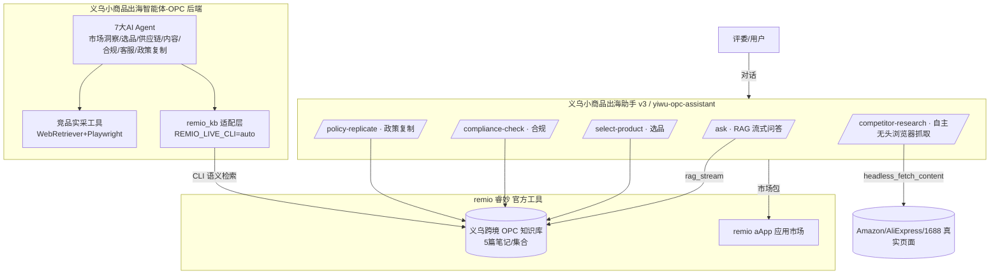

# 架构设计

## 总体架构（赛事交付视角）

## 关键设计点
- **官方工具闭环**：知识库与 aApp 均用 remio 官方工具构建，满足赛道硬性要求。
- **工具调用与自主性（赛道核心）**：aApp 在 remio 运行时内自主调用 `headless_fetch_content` 真实抓取竞品页；后端另以 WebRetriever/Playwright 做真实浏览器调研。
- **多智能体编排**：aApp 暴露选品/合规/政策复制 3 个语义端点 + RAG 问答 + 竞品实采，后端 7 大 Agent 协同。
- **检索增强**：后端 `remio_kb.py` 在 remio 桌面端运行时经 CLI 实时语义检索官方知识库。

## 数据流（竞品实采）
1. 用户输入品类 → `POST /competitor-research`
2. aApp 循环调用 `headless_fetch_content` 抓取 Amazon/AliExpress/1688 搜索页
3. 用 `run_prompt`（capabilities=none）提炼价格/卖点/差异化/选品建议
4. 通过 `send_chat_message` 流式回传，失败自动回退到知识库回答
